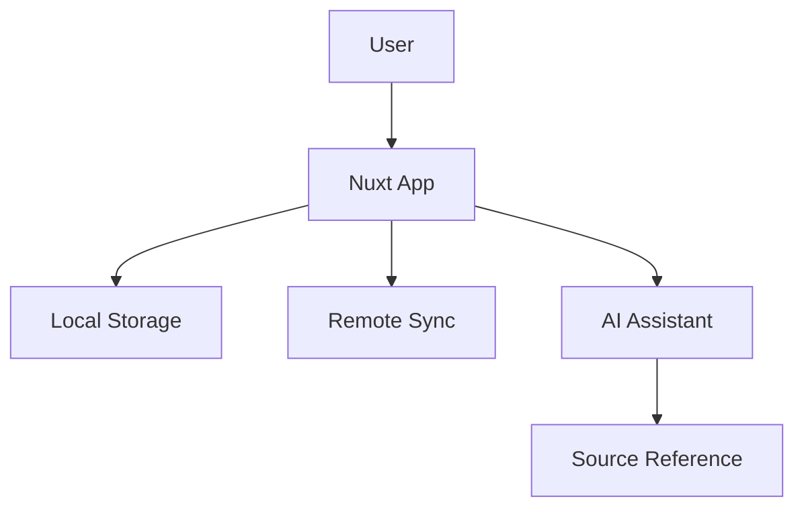

# Forget-Me-Note

Forget-Me-Note is an AI-first, fast, local-first note-taking application designed for quick capture, flexible organization, and safe AI assistance. It supports syncing across devices, advanced metadata, and integrates with modern developer workflows.

---

## Technology Stack

- **Framework:** Nuxt 3 (Vue 3 Composition API)
- **Language:** TypeScript (ES2022 target)
- **Styling:** Tailwind CSS
- **Build Tool:** Vite
- **Testing:** Playwright (E2E)
- **CI/CD:** GitHub Actions (CodeQL, quality gates)

---

## Project Architecture

The app uses a modular architecture:

- **Frontend:** Nuxt 3 SPA with Composition API, local-first storage, and responsive UI
- **Backend/Sync:** Background sync to remote DB, with conflict resolution
- **AI Layer:** Safe AI for summarization, organization, and chat, with source referencing
- **CI/CD:** Automated workflows for linting, type-checking, build, dependency audit, and security analysis

Simple architecture diagram (see docs/spec/workflows):



---

## Getting Started

### Prerequisites

- Node.js 22+
- npm, pnpm, yarn, or bun

### Installation

```bash
# npm
npm install
# pnpm
pnpm install
# yarn
yarn install
# bun
bun install
```

### Development

Start the development server:

```bash
npm run dev
# or
pnpm dev
# or
yarn dev
# or
bun run dev
```

Visit [http://localhost:3000](http://localhost:3000)

### Production Build

```bash
npm run build
npm run preview
```

---

## Project Structure

```
app/         # Main Nuxt app and components
docs/        # Documentation, specs, ideas
public/      # Static assets
.github/     # Workflows, instructions, prompts
```

See [docs/spec/workflows](docs/spec/workflows/) for workflow specs.

---

## Key Features

- **Quick Capture:** One-line notes, meeting templates, web clippings
- **Local-First Storage:** Fast, offline access with background sync
- **Flexible Organization:** Folders, tags, auto-categorization, manual overrides
- **AI Assistance:** Summarization, todo extraction, chat interface, source referencing
- **Todos & Reminders:** Ephemeral and persistent todos, natural language dates, notifications
- **Rich Rendering:** Live markup, WYSIWYG helpers, canvas/brainstorm mode
- **Sync & Accounts:** Multi-device sync, login, conflict resolution
- **Integrations:** Calendar, GitHub Projects, email, voice/OCR (planned)
