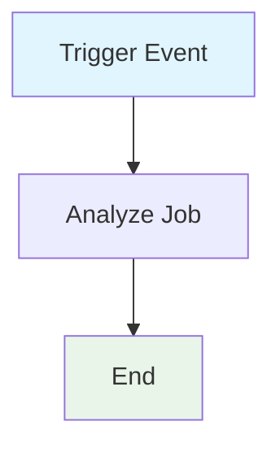

## Workflow Overview

**Purpose**: Automate static code analysis for security vulnerabilities using CodeQL on all code changes and on a scheduled basis.
**Trigger Events**:

- Push to `main` branch
- Pull request targeting `main` branch
- Scheduled weekly run (Monday 6 AM UTC)
  **Target Environments**: GitHub-hosted Ubuntu runners

## Execution Flow Diagram



## Jobs & Dependencies

| Job Name | Purpose             | Dependencies | Execution Context |
| -------- | ------------------- | ------------ | ----------------- |
| analyze  | Run CodeQL analysis | None         | ubuntu-latest     |

## Requirements Matrix

### Functional Requirements

| ID      | Requirement                               | Priority | Acceptance Criteria                |
| ------- | ----------------------------------------- | -------- | ---------------------------------- |
| REQ-001 | Analyze code for security vulnerabilities | High     | CodeQL runs on all triggers        |
| REQ-002 | Support multiple languages via matrix     | Medium   | Matrix includes required languages |
| REQ-003 | Store results in security events          | High     | Results uploaded to GitHub         |

### Security Requirements

| ID      | Requirement                | Implementation Constraint         |
| ------- | -------------------------- | --------------------------------- |
| SEC-001 | Write security events      | `security-events: write` required |
| SEC-002 | Read repository contents   | `contents: read` required         |
| SEC-003 | Read internal CodeQL packs | `packages: read` if needed        |
| SEC-004 | Restrict permissions       | Principle of least privilege      |

### Performance Requirements

| ID       | Metric        | Target        | Measurement Method        |
| -------- | ------------- | ------------- | ------------------------- |
| PERF-001 | Analysis time | ≤ 360 min/job | Job timeout configuration |
| PERF-002 | Success rate  | 100%          | Workflow run status       |

## Input/Output Contracts

### Inputs

```yaml
# Environment Variables
None required

# Repository Triggers
branches: [main]
paths: [all]
```

### Outputs

```yaml
# Job Outputs
security_events: file # Description: CodeQL analysis results
```

### Secrets & Variables

| Type     | Name              | Purpose                 | Scope |
| -------- | ----------------- | ----------------------- | ----- |
| Variable | matrix.language   | Language for analysis   | Job   |
| Variable | matrix.build-mode | Build mode for analysis | Job   |

## Execution Constraints

### Runtime Constraints

- **Timeout**: 360 minutes per job
- **Concurrency**: Single job per trigger
- **Resource Limits**: GitHub-hosted runner defaults

### Environmental Constraints

- **Runner Requirements**: Ubuntu-latest
- **Network Access**: GitHub API, CodeQL packs
- **Permissions**: `security-events: write`, `contents: read`, `actions: read`, `packages: read`

## Error Handling Strategy

| Error Type       | Response        | Recovery Action         |
| ---------------- | --------------- | ----------------------- |
| Build Failure    | Mark job failed | Notify, review logs     |
| Analysis Failure | Mark job failed | Notify, review logs     |
| Timeout          | Mark job failed | Increase resources/time |

## Quality Gates

### Gate Definitions

| Gate          | Criteria             | Bypass Conditions |
| ------------- | -------------------- | ----------------- |
| Security Scan | No critical findings | Manual override   |
| Completion    | Job completes        | None              |

## Monitoring & Observability

### Key Metrics

- **Success Rate**: Target 100%
- **Execution Time**: ≤ 360 min/job
- **Resource Usage**: GitHub runner monitoring

### Alerting

| Condition        | Severity | Notification Target |
| ---------------- | -------- | ------------------- |
| Job failure      | High     | DevOps Team         |
| Security finding | High     | Security Team       |

## Integration Points

### External Systems

| System | Integration Type | Data Exchange   | SLA Requirements |
| ------ | ---------------- | --------------- | ---------------- |
| GitHub | API              | Security events | GitHub default   |

### Dependent Workflows

| Workflow | Relationship | Trigger Mechanism |
| -------- | ------------ | ----------------- |
| None     | N/A          | N/A               |

## Compliance & Governance

### Audit Requirements

- **Execution Logs**: Retained per GitHub policy
- **Approval Gates**: Not required for analysis
- **Change Control**: Update workflow via PR

### Security Controls

- **Access Control**: GitHub permissions model
- **Secret Management**: No secrets required
- **Vulnerability Scanning**: Weekly scheduled scan

## Edge Cases & Exceptions

### Scenario Matrix

| Scenario             | Expected Behavior          | Validation Method   |
| -------------------- | -------------------------- | ------------------- |
| Large codebase       | Analysis completes/timeout | Job status, logs    |
| Unsupported language | Job skips analysis         | Matrix config, logs |
| Private repo         | Permissions enforced       | Job config, logs    |

## Validation Criteria

### Workflow Validation

- **VLD-001**: CodeQL runs on all triggers
- **VLD-002**: Results uploaded to security events

### Performance Benchmarks

- **PERF-001**: Analysis completes within timeout
- **PERF-002**: No missed triggers

## Change Management

### Update Process

1. **Specification Update**: Modify this document first
2. **Review & Approval**: PR review by DevOps/Security
3. **Implementation**: Update workflow file
4. **Testing**: Validate on test branch
5. **Deployment**: Merge to main

### Version History

| Version | Date       | Changes               | Author  |
| ------- | ---------- | --------------------- | ------- |
| 1.0     | 2025-11-10 | Initial specification | Copilot |

## Related Specifications

- [Link to related workflow specs]
- [Link to infrastructure specs]
- [Link to deployment specs]
