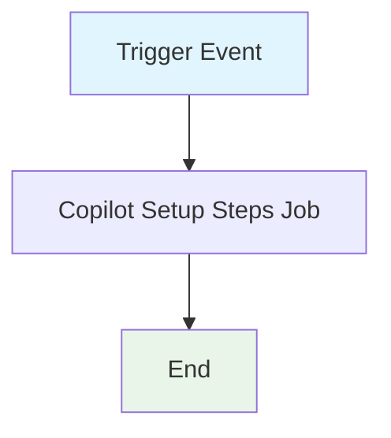

## Workflow Overview

**Purpose**: Validate repository setup and code quality for Copilot compatibility, including linting, building, and type checking.
**Trigger Events**:

- Manual dispatch
- Push to `.github/workflows/copilot-setup-steps.yml`
- Pull request affecting `.github/workflows/copilot-setup-steps.yml`
  **Target Environments**: GitHub-hosted Ubuntu runners

## Execution Flow Diagram



````

## Jobs & Dependencies

| Job Name             | Purpose                        | Dependencies | Execution Context   |
| -------------------- | ------------------------------ | ------------ | ------------------ |
| copilot-setup-steps  | Validate repo setup for Copilot| None         | ubuntu-latest      |

## Requirements Matrix

### Functional Requirements

| ID      | Requirement                        | Priority | Acceptance Criteria                |
| ------- | ----------------------------------- | -------- | ---------------------------------- |
| REQ-001 | Checkout repository code            | High     | Code is available for steps        |
| REQ-002 | Set up Node.js environment          | High     | Node.js 22 is available            |
| REQ-003 | Install dependencies                | High     | All dependencies installed         |
| REQ-004 | Run linter                          | High     | Lint passes or fails with report   |
| REQ-005 | Build project                       | High     | Build completes or fails           |
| REQ-006 | Run type check                      | High     | Type check passes or fails         |

### Security Requirements

| ID      | Requirement                  | Implementation Constraint         |
| ------- | ---------------------------- | --------------------------------- |
| SEC-001 | Read repository contents     | `contents: read` required         |
| SEC-002 | Restrict permissions         | Principle of least privilege      |

### Performance Requirements

| ID       | Metric         | Target         | Measurement Method         |
| -------- | -------------- | -------------- | -------------------------- |
| PERF-001 | Setup time     | ≤ 30 min/job   | Job timeout configuration  |
| PERF-002 | Success rate   | 100%           | Workflow run status        |

## Input/Output Contracts

### Inputs

```yaml
# Environment Variables
None required

# Repository Triggers
paths: [.github/workflows/copilot-setup-steps.yml]
branches: [all]
````

### Outputs

```yaml
# Job Outputs
lint_report: file # Description: Linter results
build_artifact: file # Description: Build output
```

### Secrets & Variables

| Type     | Name         | Purpose                   | Scope |
| -------- | ------------ | ------------------------- | ----- |
| Variable | node-version | Node.js version for setup | Job   |

## Execution Constraints

### Runtime Constraints

- **Timeout**: 30 minutes per job
- **Concurrency**: Single job per trigger
- **Resource Limits**: GitHub-hosted runner defaults

### Environmental Constraints

- **Runner Requirements**: Ubuntu-latest
- **Network Access**: GitHub API, npm registry
- **Permissions**: `contents: read`

## Error Handling Strategy

| Error Type         | Response        | Recovery Action         |
| ------------------ | --------------- | ----------------------- |
| Lint Failure       | Mark job failed | Notify, review logs     |
| Build Failure      | Mark job failed | Notify, review logs     |
| Type Check Failure | Mark job failed | Notify, review logs     |
| Timeout            | Mark job failed | Increase resources/time |

## Quality Gates

### Gate Definitions

| Gate          | Criteria           | Bypass Conditions |
| ------------- | ------------------ | ----------------- |
| Lint Pass     | No errors/warnings | Manual override   |
| Build Success | Build completes    | None              |
| Type Check    | No type errors     | Manual override   |

## Monitoring & Observability

### Key Metrics

- **Success Rate**: Target 100%
- **Execution Time**: ≤ 30 min/job
- **Resource Usage**: GitHub runner monitoring

### Alerting

| Condition   | Severity | Notification Target |
| ----------- | -------- | ------------------- |
| Job failure | High     | DevOps Team         |
| Lint error  | Medium   | Dev Team            |
| Build error | High     | Dev Team            |
| Type error  | Medium   | Dev Team            |

## Integration Points

### External Systems

| System | Integration Type | Data Exchange   | SLA Requirements |
| ------ | ---------------- | --------------- | ---------------- |
| GitHub | API              | Workflow status | GitHub default   |
| npm    | Registry         | Package install | npm default      |

### Dependent Workflows

| Workflow | Relationship | Trigger Mechanism |
| -------- | ------------ | ----------------- |
| None     | N/A          | N/A               |

## Compliance & Governance

### Audit Requirements

- **Execution Logs**: Retained per GitHub policy
- **Approval Gates**: Not required for setup
- **Change Control**: Update workflow via PR

### Security Controls

- **Access Control**: GitHub permissions model
- **Secret Management**: No secrets required
- **Vulnerability Scanning**: Not applicable

## Edge Cases & Exceptions

### Scenario Matrix

| Scenario                 | Expected Behavior     | Validation Method |
| ------------------------ | --------------------- | ----------------- |
| Dependency install fails | Job fails, logs error | Job status, logs  |
| Lint fails               | Job fails, logs error | Job status, logs  |
| Build fails              | Job fails, logs error | Job status, logs  |
| Type check fails         | Job fails, logs error | Job status, logs  |

## Validation Criteria

### Workflow Validation

- **VLD-001**: All setup steps run on trigger
- **VLD-002**: Lint, build, and type check results are reported

### Performance Benchmarks

- **PERF-001**: Setup completes within timeout
- **PERF-002**: No missed triggers

## Change Management

### Update Process

1. **Specification Update**: Modify this document first
2. **Review & Approval**: PR review by DevOps/Engineering
3. **Implementation**: Update workflow file
4. **Testing**: Validate on test branch
5. **Deployment**: Merge to main

### Version History

| Version | Date       | Changes               | Author  |
| ------- | ---------- | --------------------- | ------- |
| 1.0     | 2025-11-10 | Initial specification | Copilot |

## Related Specifications

- [Link to related workflow specs]
- [Link to infrastructure specs]
- [Link to deployment specs]
