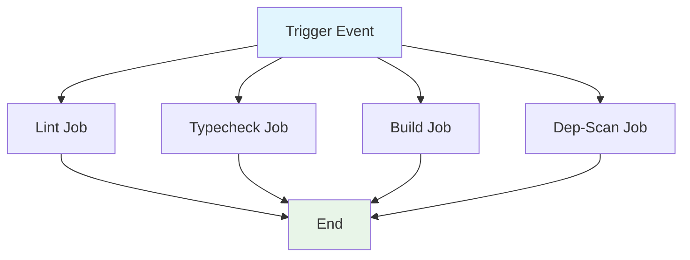

## Workflow Overview

**Purpose**: Enforce code quality, type safety, build integrity, and dependency security on all changes to the main branch.
**Trigger Events**:

- Push to `main` branch
- Pull request targeting `main` branch
  **Target Environments**: GitHub-hosted Ubuntu runners

## Execution Flow Diagram



## Jobs & Dependencies

| Job Name  | Purpose                         | Dependencies | Execution Context |
| --------- | ------------------------------- | ------------ | ----------------- |
| lint      | Enforce code style and quality  | None         | ubuntu-latest     |
| typecheck | Ensure type safety              | None         | ubuntu-latest     |
| build     | Validate build integrity        | None         | ubuntu-latest     |
| dep-scan  | Audit dependencies for security | None         | ubuntu-latest     |

## Requirements Matrix

### Functional Requirements

| ID      | Requirement                           | Priority | Acceptance Criteria               |
| ------- | ------------------------------------- | -------- | --------------------------------- |
| REQ-001 | Lint code for style and errors        | High     | Lint passes or fails with report  |
| REQ-002 | Type check for correctness            | High     | Type check passes or fails        |
| REQ-003 | Build project                         | High     | Build completes or fails          |
| REQ-004 | Scan dependencies for vulnerabilities | High     | Audit passes or fails with report |

### Security Requirements

| ID      | Requirement              | Implementation Constraint    |
| ------- | ------------------------ | ---------------------------- |
| SEC-001 | Read repository contents | `contents: read` required    |
| SEC-002 | Restrict permissions     | Principle of least privilege |
| SEC-003 | Audit dependencies       | Security scan required       |

### Performance Requirements

| ID       | Metric       | Target       | Measurement Method        |
| -------- | ------------ | ------------ | ------------------------- |
| PERF-001 | Job time     | ≤ 30 min/job | Job timeout configuration |
| PERF-002 | Success rate | 100%         | Workflow run status       |

## Input/Output Contracts

### Inputs

```yaml
# Environment Variables
None required

# Repository Triggers
branches: [main]
paths: [all]
```

### Outputs

```yaml
# Job Outputs
lint_report: file # Description: Linter results
typecheck_report: file # Description: Type check results
build_artifact: file # Description: Build output
dep_scan_report: file # Description: Dependency audit results
```

### Secrets & Variables

| Type     | Name         | Purpose                   | Scope |
| -------- | ------------ | ------------------------- | ----- |
| Variable | node-version | Node.js version for setup | Job   |

## Execution Constraints

### Runtime Constraints

- **Timeout**: 30 minutes per job
- **Concurrency**: All jobs run in parallel per trigger
- **Resource Limits**: GitHub-hosted runner defaults

### Environmental Constraints

- **Runner Requirements**: Ubuntu-latest
- **Network Access**: GitHub API, npm registry
- **Permissions**: `contents: read`

## Error Handling Strategy

| Error Type         | Response        | Recovery Action         |
| ------------------ | --------------- | ----------------------- |
| Lint Failure       | Mark job failed | Notify, review logs     |
| Type Check Failure | Mark job failed | Notify, review logs     |
| Build Failure      | Mark job failed | Notify, review logs     |
| Audit Failure      | Mark job failed | Notify, review logs     |
| Timeout            | Mark job failed | Increase resources/time |

## Quality Gates

### Gate Definitions

| Gate          | Criteria              | Bypass Conditions |
| ------------- | --------------------- | ----------------- |
| Lint Pass     | No errors/warnings    | Manual override   |
| Type Check    | No type errors        | Manual override   |
| Build Success | Build completes       | None              |
| Security Scan | No moderate+ findings | Manual override   |

## Monitoring & Observability

### Key Metrics

- **Success Rate**: Target 100%
- **Execution Time**: ≤ 30 min/job
- **Resource Usage**: GitHub runner monitoring

### Alerting

| Condition   | Severity | Notification Target |
| ----------- | -------- | ------------------- |
| Job failure | High     | DevOps Team         |
| Lint error  | Medium   | Dev Team            |
| Type error  | Medium   | Dev Team            |
| Build error | High     | Dev Team            |
| Audit error | High     | Security Team       |

## Integration Points

### External Systems

| System | Integration Type | Data Exchange   | SLA Requirements |
| ------ | ---------------- | --------------- | ---------------- |
| GitHub | API              | Workflow status | GitHub default   |
| npm    | Registry         | Package install | npm default      |

### Dependent Workflows

| Workflow | Relationship | Trigger Mechanism |
| -------- | ------------ | ----------------- |
| None     | N/A          | N/A               |

## Compliance & Governance

### Audit Requirements

- **Execution Logs**: Retained per GitHub policy
- **Approval Gates**: Not required for quality gates
- **Change Control**: Update workflow via PR

### Security Controls

- **Access Control**: GitHub permissions model
- **Secret Management**: No secrets required
- **Vulnerability Scanning**: Audit on every run

## Edge Cases & Exceptions

### Scenario Matrix

| Scenario                  | Expected Behavior     | Validation Method |
| ------------------------- | --------------------- | ----------------- |
| Dependency install fails  | Job fails, logs error | Job status, logs  |
| Lint fails                | Job fails, logs error | Job status, logs  |
| Build fails               | Job fails, logs error | Job status, logs  |
| Type check fails          | Job fails, logs error | Job status, logs  |
| Audit finds vulnerability | Job fails, logs error | Job status, logs  |

## Validation Criteria

### Workflow Validation

- **VLD-001**: All quality gate jobs run on trigger
- **VLD-002**: Lint, typecheck, build, and audit results are reported

### Performance Benchmarks

- **PERF-001**: All jobs complete within timeout
- **PERF-002**: No missed triggers

## Change Management

### Update Process

1. **Specification Update**: Modify this document first
2. **Review & Approval**: PR review by DevOps/Engineering
3. **Implementation**: Update workflow file
4. **Testing**: Validate on test branch
5. **Deployment**: Merge to main

### Version History

| Version | Date       | Changes               | Author  |
| ------- | ---------- | --------------------- | ------- |
| 1.0     | 2025-11-10 | Initial specification | Copilot |

## Related Specifications

- [Link to related workflow specs]
- [Link to infrastructure specs]
- [Link to deployment specs]
